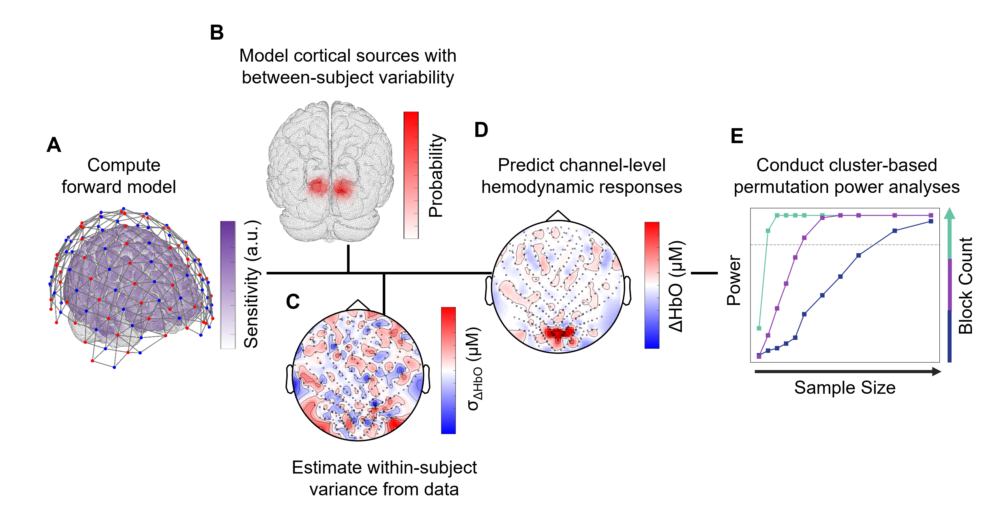

# fnirspower

This repository is the companion software release for
[*Measurement Prediction and Power Analysis for fNIRS and DOT*](https://doi.org/10.1162/IMAG.a.1289), 
published in *Imaging Neuroscience*.

`fnirspower` combines MATLAB tools for fNIRS/DOT measurement prediction 
with Python utilities for cluster-based power analysis. 
We developed these tools to address a common challenge: 
researchers often do not know whether fNIRS or DOT will be sufficiently sensitive for a given research question. 

This framework allows researchers to estimate the sample sizes and block counts 
needed to achieve adequate statistical power, under the assumptions laid out in the linked research article. 
These tools  aim to aid study design and ultimately increase the utility of fNIRS and DOT.


## Main features

- ROI-based prediction of channel-level changes in oxy- and deoxy- hemoglobin (ΔHbO and ΔHbR)
- Cluster-based permutation power analysis across sample sizes and block counts
- Subject-level probabilistic source simulation
- Absorption-magnitude and within-subject variance estimation
- Support for forward-model, GLM, visualization, and Slurm workflows

## Repository structure

```text
fnirspower/
├─ matlab/       # MATLAB package, examples, and bundled dependencies
├─ python/       # Python simulation, processing, and Slurm utilities
├─ docs/         # Installation and workflow documentation
└─ workspace/    # Models, layouts, data, and generated outputs
```

The supplied examples use the provided ICBM-based head model and NIRx-compatible data structures. 
Other models, montages, and systems will require adaptation. We provide utilities to help make these changes.

## Getting started

1. Follow the [installation guide](docs/installation.md). 
2. Run the complete example in the [getting started guide](docs/getting_started.md).

Briefly, first download the repo and confirm MATLAB paths and packages. 
Next, set up the Python environment on a computing cluster.
Finally, walk through the typical workflow using the getting started guide.

## Typical workflow

1. Define a head model, montage and forward model in MATLAB.
2. Select ROI(s) on brain and model between-subject variability.
3. Estimate / model within-subject variability.
4. Generate subject-level predicted channel measurements.
5. Run power simulations in Python (on a computing cluster).

<table align="center" width="90%">
  <tr>
    <td align="center">
      
    </td>
  </tr>
  <tr>
    <td align="justify">
      <em>
        Figure 1: Schematic of steps to conduct a priori power analyses for experiments using fNIRS or DOT.
        (A) A forward sensitivity matrix is computed using NIRFAST, relating absorption changes in a five-layer
        head mesh (derived from the ICBM 2009c asymmetric template) to an optode montage defined in NIRSite
        (NIRx). Absorption magnitudes used in subsequent simulations can be estimated from experimental data
        using this forward model. The panel illustrates the optode montage and cortical mesh overlaid with
        normalized flat-field sensitivity (purple), sources (red), detectors (blue), and channels (grey lines).
        (B) Cortical sources are modeled with physiologically plausible between-subject variability, represented
        here as a probabilistic map of exemplar source locations across simulated subjects.
        (C) Within-subject variance is estimated from channel-level ΔHbO time series as a function of block count,
        illustrated as channel-wise variability.
        (D) Task-evoked cortical activations are forward-modeled and combined with simulated within-subject
        variability to generate predicted channel-level ΔHbO measurements.
        (E) Simulated datasets are analyzed using cluster-based permutation testing to estimate statistical power
        as a function of sample size and block count. Block count is represented, in ascending order, by blue,
        purple, and cyan lines.
      </em>
    </td>
  </tr>
</table>

## Core entry points / examples

The core MATLAB functions are held in `fnirspower/matlab/+fnirspower/+pipeline`. 
The main pipeline for running measurement prediction is:

```matlab
fnirspower.pipeline.run_measurement_prediction
```

Implementing this pipeline is covered in the example in the [getting started guide](getting_started.md).

We provide additional MATLAB pipelines that support forward modeling, subject- and group-level GLMs, 
absorption estimation, and variance estimation. We provide all materials necessary such that these additional pipelines do not need to be run for measurement prediction.
Guides for each pipeline may be released in the future or upon request. 

We also provide 2 examples related to power analyses in Python. The first runs power analysis based on MATLAB output; the second processes and plots its output:

```text
python/examples/sim_cluster_based_power_parallelized.py
python/examples/sim_cluster_based_power_process.py
```

___

## Citation

Please cite the associated paper when using this software:

Eli Bulger, Jiaming Cao, Abigail L. Noyce, Barbara G. Shinn-Cunningham, Jana M. Kainerstorfer; 
Measurement Prediction and Power Analysis for fNIRS and DOT. *Imaging Neuroscience* 2026; 
doi: https://doi.org/10.1162/IMAG.a.1289

___

## Status and contact

This repository is an active research-software release. 
For questions about the code or workflows, feel free to contact the repo maintainer(s).
If you encounter any errors during use of this package, please don't hesitate to contact the repo maintainer(s).

--- 

#### AI Disclosure

LLMs assisted with minor documentation editing, code refactoring, and drafting small helper functions. 
All outputs were reviewed, tested, and manually edited by the authors. 
LLMs were not used to generate data, analyses, results, conclusions, or other substantive content.


