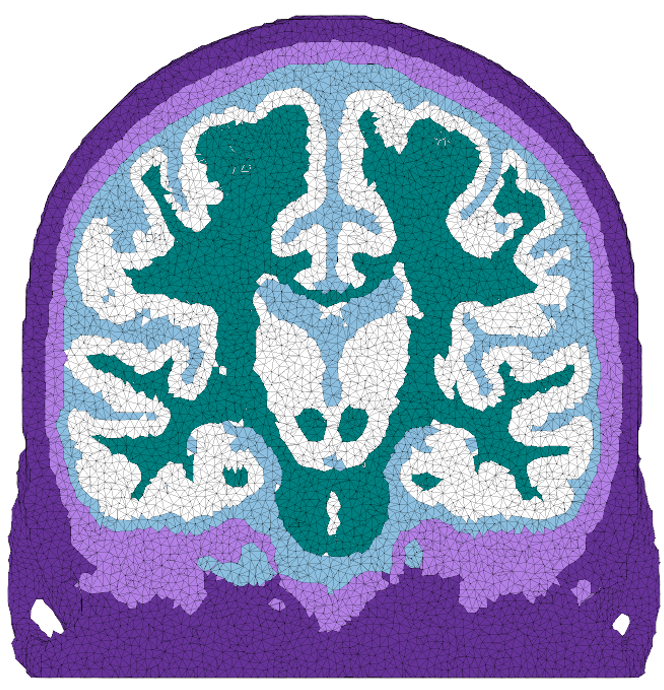
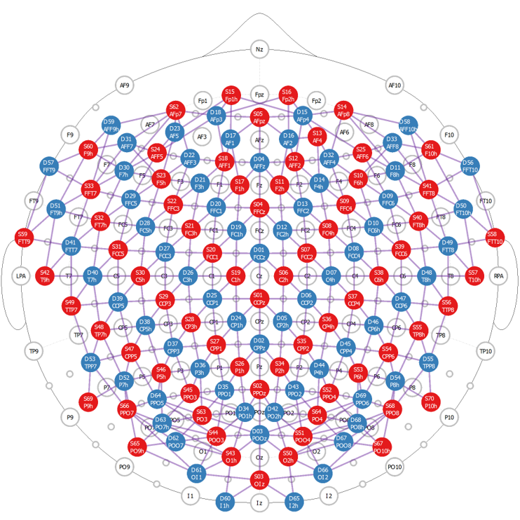
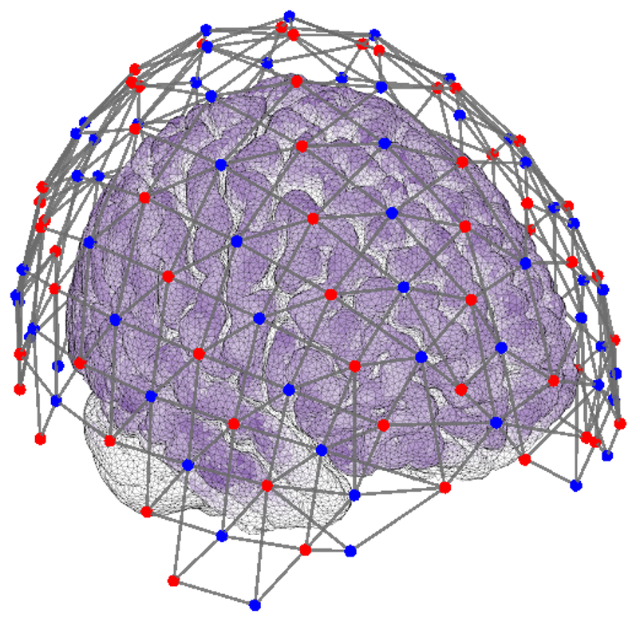
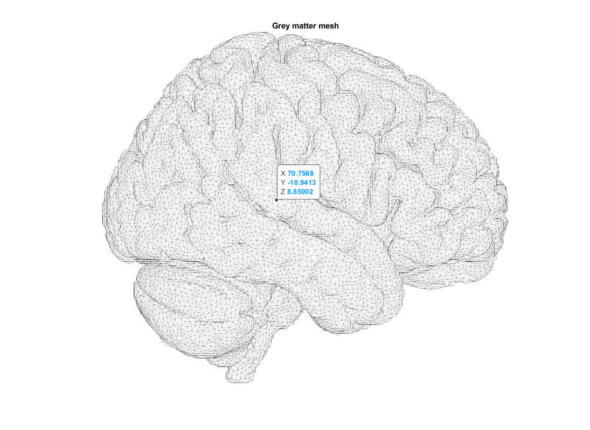
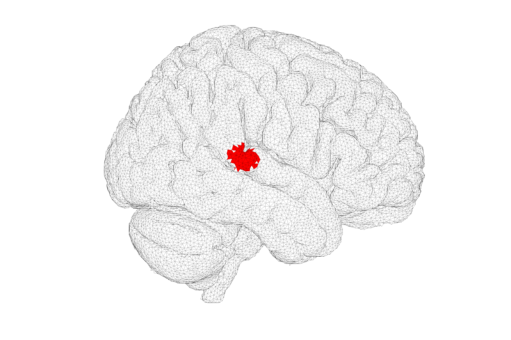
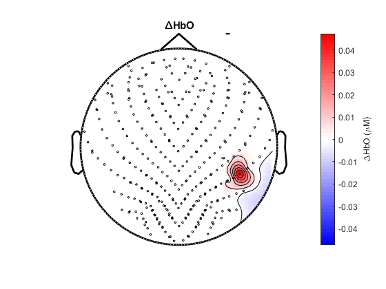
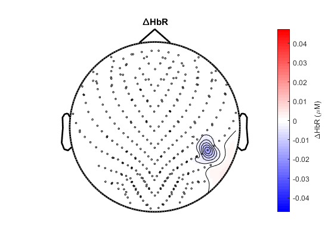
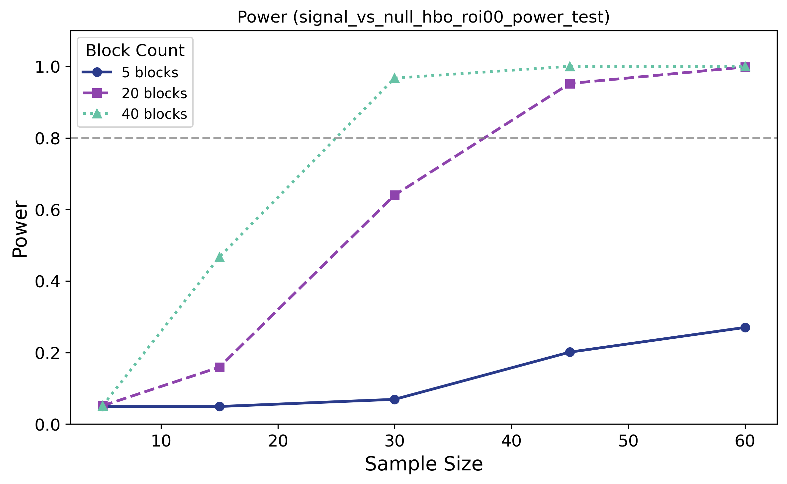

# Getting started

This guide walks through one complete example using `fnirspower`, from MATLAB setup through Python-based power analysis. 
The majority of the steps covered in this example can also be found in the
`matlab/examples/run_measurement_prediction_step.m` MATLAB file.

The goal is to help new users get one workflow running successfully before moving on to their own custom implementations.

---

## What this example covers

This guide walks through a complete measurement-prediction and power-analysis workflow. You will:

1. Configure the MATLAB paths and dependencies
2. Load the head model, forward model, and montage layout
3. Define a cortical region of interest and its expected variability
4. Specify an estimated or assumed absorption-change magnitude
5. Generate subject-level channel predictions in MATLAB
6. Save the predicted measurements for use in Python
7. Configure and submit a cluster-based power analysis
8. Process the simulation results and generate a power summary plot

---

## Assumptions and scope

This guide is built around the materials provided with the `fnirspower` repository.
The current examples assume **NIRx NIRSport2-compatible data structures**, a **NIRx-style `probeInfo` file**,
a head model based on **ICBM 2009c nonlinear asymmetric head model** and related forward-model assets. 
We provide all the necessary resources and code to run these examples.

Our framework is generalizable to other setups, but using other systems, models, 
or data structures may require additional formatting or adaptation beyond the materials provided here.

___

## Before you begin

Make sure you have already completed the installation steps in:

- `docs/installation.md`

You should have:

- MATLAB configured and able to find `fnirspower`
- the required third-party MATLAB dependencies available
- a working Python environment
- the required mesh, model, and layout files available in your project structure

---

## Step 1. Start MATLAB and set up paths

Open a fresh MATLAB session and run:

```matlab
P = fnirspower.setup_paths();
```

This should add:

- the `fnirspower` package
- required third-party dependencies
- the project MATLAB root


---

## Step 2. Load the model geometry

Create a MATLAB script or live script and define the mesh, forward model, and layout.

Example:

```matlab
mesh_mat       = fullfile(P.icbm_mesh_dir, 'ICBM_mesh_5layer.mat');
nirsmodel_file = fullfile(P.forward, 'nirs_mesh_ICBM_5layer_dense_nirsmodel.mat');
layout_file    = fullfile(P.layouts, 'layout_dense.mat');
```

The provided assets for running measurement predictions are shown below:

<table align="center">
  <tr>
    <td align="center" width="50%">
      
      <br>
      <em>Figure 1. Tetrahedral head mesh used for the default example workflow. 
Layers shown are scalp, skull, CSF, grey matter and white matter. </em>
    </td>
    <td align="center" width="50%">
      
      <br>
      <em>Figure 2. 'Dense' optode montage used for the default example workflow. 
Red circles represent sources, blue circles represent detectors.</em>
    </td>
  </tr>
  <tr>
    <td colspan="2" align="center">
      
      <br>
      <em>Figure 3. Example flat-field sensitivity map on the brain mesh; optode montage is overlayed.</em>
    </td>
  </tr>
</table>

---

## Step 3. Define a region of interest (ROI)
After defining the model geometry, the next step is to **select the ROI center coordinates**, 
which are specified in `centers_mm`. The provided head mesh is approximately aligned with ICBM space, 
so template coordinates can be used as a starting point; however, because the mesh is based on a custom segmentation, 
this alignment is not exact. In practice, `centers_mm` can be chosen manually by plotting the grey-matter mesh in MATLAB 
and selecting a node or surface location or adapted from pilot data or pre-existing atlases 
(many of which are available packaged with FieldTrip).

Example of how to hand-select:

```
%% Optional grey-matter mesh plot
plotGreyMatter = 1;

if plotGreyMatter
    mesh_model = load(mesh_mat);

    if isfield(mesh_model,'genmesh')
        p = mesh_model.genmesh.node(:,1:3);
        e = mesh_model.genmesh.ele;
    else
        p = mesh_model.p;
        e = mesh_model.e;
    end

    figure('Position',[600 200 1200 800]); hold on;
    iso2mesh_plotmesh(p, e(e(:,5)==1,:), 'EdgeAlpha', 0.2, 'FaceColor', [1, 1, 1], 'FaceAlpha', 1);
    iso2mesh_plotmesh(p, e(e(:,5)==2,:), 'EdgeAlpha', 0.2, 'FaceColor', [1, 1, 1], 'FaceAlpha', 1);
    xlabel('x'); ylabel('y'); zlabel('z');
    title('Brain mesh');
    view([90, 0])
    axis equal;
    axis off;
end
```

The brain mesh looks like this, and locations on the surface can be selected interactively in MATLAB. 
In this example, we select a source on the superior temporal gyrus.

<p align="center">
    
    <br>
    <em>Figure 4. Brain mesh from which ROI locations can be selected.</em>
</p>

```matlab
roi_def = struct();
roi_def.centers_mm = [-70, -10, 9];
roi_def.radius_mm  = 2;
roi_def.sigma_mm   = 4;
roi_def.amp_std    = 0.3;
roi_def.names      = {'AuditoryDepth'};
```

For a single ROI, the location can be plotted as:

```
%% Optional ROI plot on grey-matter mesh
plotROIOnMesh = 1;

if plotROIOnMesh
    mesh_model = load(mesh_mat);

    if isfield(mesh_model,'genmesh')
        p = mesh_model.genmesh.node(:,1:3);
        e = mesh_model.genmesh.ele;
    else
        p = mesh_model.p;
        e = mesh_model.e;
    end
    
    % select grey matter nodes
    gm_ele = e(e(:,5)==2,:);
    gm_nodes_idx = unique(gm_ele(:,1:4));
    p_gm = p(gm_nodes_idx,:);

    % select nodes within the ROI
    roi_center = roi_def.centers_mm(1,:);
    roi_radius = roi_def.radius_mm(1);

    d = sqrt(sum((p_gm - roi_center).^2, 2));
    roi_mask = d <= roi_radius;

    roi_overlay = zeros(size(p,1),1);
    roi_overlay(gm_nodes_idx(roi_mask)) = 1;

    % plot the ROI
    p_plot = [p roi_overlay];

    figure('Position',[600 200 1200 800]); hold on;
    iso2mesh_plotmesh(p, e(e(:,5)==1,:), 'EdgeAlpha', 0.2, 'FaceColor', [1, 1, 1], 'FaceAlpha', 1);
    iso2mesh_plotmesh(p_plot, gm_ele, 'EdgeAlpha', 0.2, 'FaceAlpha', 1);

    colormap(redblue);
    caxis([-1 1]);

    xlabel('x'); ylabel('y'); zlabel('z');
    view([90, 0])
    axis equal;
    axis off;
end
```

<p align="center">
    
    <br>
    <em>Figure 5. Example ROI plotted on the brain mesh.</em>
</p>


---

## Step 4. Set the absorption-change magnitude

For a given condition where we expect a hemodynamic response within our ROI, 
we must assume a change in absorption coefficient. 
In this example, the provided $\Delta\mu_a$ file is estimated using data from a visual checkerboard experiment, 
with $\Delta\mu_a$ values scaled down to approximate values more suitable for a wider range of conditions.
If you have your own fNIRS or DOT data, you may be able to use our absorption estimation workflow.

For this example, we recommend using our provided file, or example assumed values (i.e. [1e-6; 1e-4] mm-1). 
Example code below:

```
dmua_file      = fullfile(P.derivatives, 'absmag', '<your_dmua_file>.mat');

prediction_mode = 'estimated';   % 'estimated' or 'assumed'

dmu_a_assumed = [1e-6; 1e-4];    % used only if prediction_mode = 'assumed';
```

If you are using an assumed absorption magnitude instead of an estimated one,
you can leave `dmua_file` empty and set `prediction_mode` to `'assumed'`, 
then provide `dmu_a` directly in the next step.

To use our default absorption coefficients, set `prediction_mode` to `'estimated'`, 
and `<your_dmua_file>.mat` to: `Default_Absorption_Results.mat`.


Other relevant parameters for measurement prediction:

- `radius_mm`: the radius of each ROI, used for sphere-based ROI definition and visualization. 
This can be adjusted to reflect a broader or narrower expected source extent.


- `sigma_mm`: the spatial spread of ROIs between subjects (i.e., center-translation variability); 
used for subject-level probabilistic ROI generation.


- `amp_std`: the standard deviation of the subject-level fractional amplitude scaling applied to each ROI. 
For example, 0.3 represents a standard deviation of 30% around the mean amplitude. 
This can be adapted from observed effect sizes or inferred from published measurements.


- `nSubjects`: the number of simulated subjects used when generating subject-level ROI probability maps and 
predicted measurements. For power analyses, we recommend this number to be large (i.e. >1000).


- `hbRatio`: the assumed ΔHbO:ΔHbR ratio used when converting ROI-level absorption changes into predicted hemoglobin 
responses. This only affects ΔHbR and is irrelevant for power analyses based on ΔHbO only.

The default values here are based on pilot data and/or prior literature. 
Custom values can be obtained from pilot measurements, simulations, informed assumptions or other reasonable sources.

For multiple ROIs:

- use one row per ROI in `centers_mm`
- provide matching vectors for `radius_mm`, `sigma_mm`, and `amp`


---

## Step 5. Run measurement prediction in MATLAB

You can run the measurement prediction step in one of two ways.

### Option A: use an estimated absorption magnitude

```matlab
M = fnirspower.pipeline.run_measurement_prediction( ...
    mesh_mat, nirsmodel_file, roi_def, dmua_file, ...
    'nSubjects', 1000, ...
    'hbRatio', 3, ...
    'dmuaScale', true, ...
    'dmuaScaleDiv', 3, ...
    'plotMesh', true, ...
    'plotROISeed', true, ...
    'plotAvgProb', true, ...
    'plotSubjects', 0, ...
    'computeDistances', true, ...
    'plotChannels', true, ...
    'layout_file', layout_file, ...
    'montageName', 'dense');
```

### Option B: use an assumed absorption magnitude

```matlab
M = fnirspower.pipeline.run_measurement_prediction( ...
    mesh_mat, nirsmodel_file, roi_def, '', ...
    'dmu_a', [1e-6; 1e-4], ...
    'dmuaScale', false, ...
    'nSubjects', 1000, ...
    'hbRatio', 3, ...
    'plotMesh', true, ...
    'plotROISeed', true, ...
    'plotAvgProb', true, ...
    'plotSubjects', 0, ...
    'computeDistances', true, ...
    'plotChannels', true, ...
    'layout_file', layout_file, ...
    'montageName', 'dense');
```

This step produces:

- probabilistic ROI maps on the grey matter mesh
- channel-level predicted ΔHbO and ΔHbR measurements (depicted below)

<table align="center">
  <tr>
    <td align="center" width="50%">
      
      <br>
      <em>Figure 6. Average of all simulated subjects' ΔHbO from the auditory cortex source </em>
    </td>
    <td align="center" width="50%">
      
      <br>
      <em>Figure 7. Average of all simulated subjects' ΔHbR from the auditory cortex source </em>
    </td>
  </tr>
</table>

Under the default configuration, channel-level data are stored in `M.chan,HbO` and `M.chan,HbR`. 
Each array has dimensions `nSubjects × nROIs × nChannels`. 
Note that this data structure does not include within-subject variance - this is modeled within the power analysis code.

---

## Step 6. Save the MATLAB output

Save the output structure `M` so it can be used for subsequent power analyses.

Example:

```matlab
outfile = fullfile(P.derivatives, 'measpred', '9999-99-99_measurement_prediction.mat');
save(outfile, 'M', '-v7.3');
fprintf('Saved: %s\n', outfile);
```

The result in this example is saved as 
`fnirspower/workspace/derivatives/predict/9999-99-99_measurement_prediction.mat`. 
The Python pipeline uses this exported structure. 

---

## Step 7. Set up a power analysis using the predicted measurements

The following steps use the predicted channel-level ΔHbO measurements generated in MATLAB, 
together with simulated within-subject variability, to estimate statistical power 
using a cluster-based permutation procedure.
The relevant code is provided in `fnirspower/python/examples/sim_cluster_based_power_parallelized.py`.

First, ensure your computing cluster has access to the `fnirspower/python` directory. 
You may need to copy or clone your local directory.

Set the input and output paths:

```python
date_tag = "9999-99-99"
data_dir = Path("fnirspower/python/fnirspower_py/data/")
save_dir = Path("fnirspower/python/fnirspower_py/results/")
```

Choose the analysis scenario and ROI indices:

```python
SCENARIO = "signal_vs_null"

ROI_1 = 0
ROI_2 = 1  # only used for signal_vs_signal
```

Available scenarios are `"null_vs_null"`, `"signal_vs_null"`, and `"signal_vs_signal"`. 

`ROI_1 = 0` selects the first ROI in `M.chan.HbO`.

Set the block and sample-size grid:

```python
blocks = np.array([5, 20, 40], dtype=float)
subject_grid = np.array([5, 15, 30, 45, 60], dtype=int)
```

Most loading and power-analysis parameters are stored in a `SimulationConfig` object:

```python
config = SimulationConfig(
    data_mat_file=data_dir / (date_tag + "_measurement_prediction.mat"),
    data_var="M.chan.HbO",
    channel_names_file=data_dir / "dense_channel_names.mat",
    channel_positions_file=data_dir / "dense_channel_positions.mat",
    save_dir=save_dir,
    date_tag=date_tag,
    scenario=SCENARIO,
    blocks=blocks,
    subject_grid=subject_grid,
    noise_amplitude=0.2,
    n_iter=1000,
    n_permutations=256,
)
```

`fnirspower.helpers.export_channel_info_NIRx` can produce the necessary channel names and positions .mat files.

`data_var` selects the predicted ΔHbO array, which should have dimensions `nSubjects × nROIs × nChannels`.

The `noise_amplitude` parameter sets the baseline within-subject estimation variability. 
For each block count, independent zero-mean Gaussian noise is added to each subject and 
channel with standard deviation `noise_amplitude / sqrt(block_count)`. In this example, we use `0.2`. 
For custom implementations, the `run_variance` pipeline function may be used to estimate a custom value.

Use smaller `n_iter` and `n_permutations` values for testing, then increase them for final analyses. 
We recommend at least 1,000 iterations and 1,024 permutations for reliable results.

The scenario-specific section of the script assigns the selected ROI indices, signal scaling, and output title. 
Each Slurm array task runs one block-count and sample-size combination.

Output files are named using the date tag, analysis title, block index, and subject-grid index, for example:

```text
9999-99-99_signal_vs_null_hbo_roi00_power_test_block00_subj00.pkl
```

Further processing will load the collection of `.pkl` outputs and plot power results.

---

## Step 8. Create a script for SLURM job submission


Open a terminal and activate the Python environment used by the project.

For example:

```bash
source ./fnirspower_py_env/bin/activate
```

or

```bash
conda activate fnirspower_py
```

We provide an example script `fnirspower\python\jobs\run_python_clust_based_power.sh` for batch submission:

The number of Slurm array jobs should equal `len(blocks) × len(subject_grid)`. 
Before running, please ensure that your computing cluster supports job array batch submission. 


```bash
#!/bin/bash
#SBATCH --job-name=<job_name>
#SBATCH --mail-type=END,FAIL
#SBATCH --mail-user=<email_address>
#SBATCH --output=<log_dir>/<job_name>%A_%a.out
#SBATCH --error=<log_dir>/<job_name>%A_%a.err
#SBATCH --time=1:00:00
#SBATCH --cpus-per-task=8
#SBATCH --mem=1G
#SBATCH --array=0-<njobs-1>%<n_parallel_jobs> # explanation: X blocks × Y subject-counts = n_jobs → indices 0-<njobs-1>; run n_parallel_jobs in parallel

# Load the required Python environment.
module load YOUR_PYTHON_OR_ANACONDA_MODULE
source /path/to/your/virtual-environment/bin/activate

# Move to the project directory so package imports and relative paths work.
cd /path/to/fnirspower/python

python ../examples/sim_cluster_based_power_parallelized.py
```

In this example, we use 3 block counts x 5 sample sizes (15 jobs). 
If using our example script, ensure you change all paths and simulation parameters accordingly.

This can be submitted to a computing cluster using SLURM by the following command:

```bash
sbatch run_python_clust_based_power.sh
```

Each block count/sample size pair is saved in the following form using pickle: 
`<date>_<scenario>_hbo_<roi_num>_power_test_<block_index>_<subject_index>.pkl`

Example: `9999-99-99_signal_vs_null_hbo_roi00_power_test_block02_subj04.pkl`

---

## Step 9. Plot the results

After the simulation completes, open `sim_cluster_based_power_process.py` and set:

```python
date2use = "9999-99-99"

data_dir = Path("/path/to/python/data")
save_dir = Path("/path/to/python/results/")  # change this
plots_dir = save_dir / "plots"

blocks = np.array([5, 20, 40], dtype=float)
subjects = np.array([5, 15, 30, 45, 60], dtype=int)
result_label = "signal_vs_null_hbo_roi00_power_test"
```

`blocks` and `subjects` should match the simulation grid, and `result_label` should match the output title generated by the simulation script. Set `plot_bbs = None` to plot all block counts, or provide selected block indices.

Run using a script or interactively. Example of SLURM sbatch script:

```bash
#!/bin/bash
#SBATCH --job-name=plot_power
#SBATCH --mail-type=END,FAIL
#SBATCH --mail-user=YOUR_EMAIL
#SBATCH --output=/path/to/logs/plot_power_%A.out
#SBATCH --error=/path/to/logs/plot_power_%A.err
#SBATCH --time=00:30:00
#SBATCH --cpus-per-task=1
#SBATCH --mem=1G

# Load the required Python environment.
module load YOUR_PYTHON_OR_ANACONDA_MODULE
source /path/to/your/virtual-environment/bin/activate

# Move to the project directory so package imports and relative paths work.
cd /path/to/fnirspower/python

python ../examples/sim_cluster_based_power_process.py
```


The script loads the result files for each block-count and sample-size combination, and saves a summary figure.

<p align="center">
    
    <br>
    <em>Figure 8. Power as a function of sample size and block count.</em>
</p>

---

## What to do next

Once this example works, you are well set up to run your own custom power analysis:
- Select a custom ROI, or test statistical power in differentiating signals from multiple ROIs
- Customize power analyses parameters (i.e., sample size, block count, within-subject variance, etc.)
- Customize optode montages or head models, requiring:
  - Forward model construction
  - Layout and data structure generation
  
We include example scripts for forward modelling, estimating absorption magnitude, within-subject variance, 
and conducting subject- and group-level GLM analyses. Please feel free to reach out if you have any questions.
